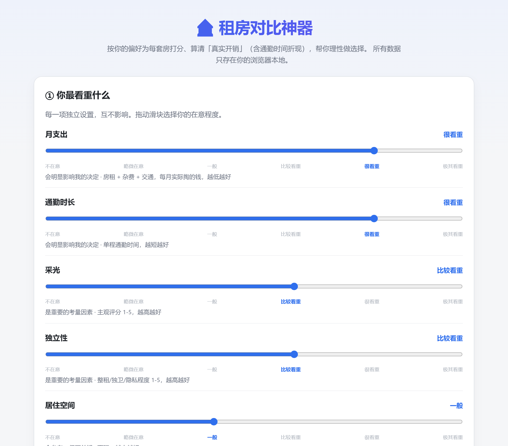
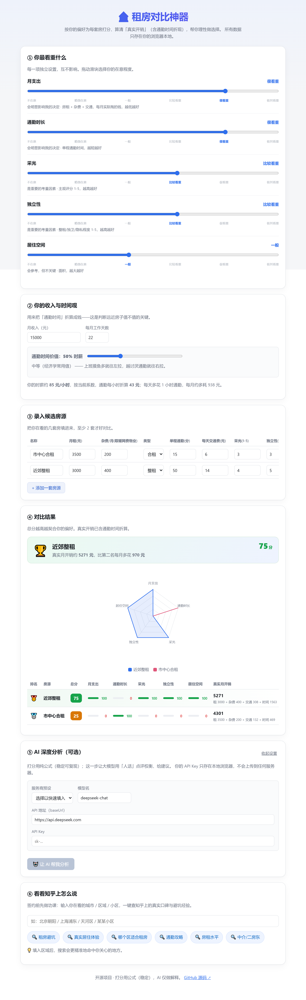

<div align="center">

# 🏠 租房对比神器 · Rent Radar

**别再凭感觉选房。** 按你的偏好为每套候选房源打分排序，并把**通勤时间折算成钱**，算清每套房的**真实月开销**——让「便宜但远」的房子现出原形。

[](https://lizhaoxinlizhaoxin2-lab.github.io/rent-radar/)




</div>

## 🤔 解决什么问题

租房决策是个典型的「多因素、每个人权重不同」难题：价格、通勤、采光、独立性、空间……更要命的是，**大多数人只看月租，却忽略了通勤时间这笔最大的隐形成本**。

> 一套月租便宜 500 的房子，如果每天多花 1 小时通勤，按你的时薪折算，很可能每月反而更贵。

Rent Radar 帮你把这些都算清楚，给出一个**可解释、可复现**的对比结果。

## ✨ 特性

- **🎚️ 独立权重挡位**：通勤、价格、采光、独立性、空间——每项独立选「在意程度」，6 档每档带描述。
- **💰 真实开销计算**：`真实月成本 = 房租 + 杂费(取暖/网费/物业) + 交通 + 通勤时间折算`。
- **⏱️ 时间价值可调**：通勤 1 小时值多少钱因人而异——上班摸鱼调低、讨厌通勤调高，告别「一刀切按时薪」。
- **📊 可视化对比**：分数条、雷达图、奖牌排名，一眼看清谁更适合你。
- **🤖 公式打分 + AI 解释分离**：打分用确定性公式（稳定可复现），大模型只负责用「人话」点评权衡——结果不会同一输入算出两个答案。
- **🔗 链接知乎**：输入城市/区域，一键查知乎上的真实租房口碑与避坑帖。
- **🔒 隐私优先**：纯前端，数据只存你浏览器本地；AI 用你自己的 API Key（兼容 DeepSeek / 通义 / OpenAI / 本地 Ollama）。

## 🚀 快速开始

直接打开 **[在线体验地址](https://lizhaoxinlizhaoxin2-lab.github.io/rent-radar/)** 即可使用，无需安装。

本地开发：

```bash
npm install
npm run dev
```

构建与预览：

```bash
npm run build    # 产物在 dist/，纯静态文件
npm run preview
```

推送到 `main` 分支后，GitHub Actions 会自动构建并部署到 GitHub Pages。

## 🧮 打分逻辑

1. 每个维度统一为「值越大越好」，在所有房源间做 min-max 归一化到 0-100。
2. 用户的「在意程度」挡位归一化为权重后加权求和，得到 0-100 总分。
3. 通勤时间成本 = `时薪 × 每天通勤小时 × 工作天数 × 时间价值系数`，时薪 = `月收入 / (工作天数 × 8)`。
4. **月支出维度只算实际掏的钱**（房租+杂费+交通），通勤时间由「通勤」维度单独负责，避免重复计权。

核心实现见 [`src/lib/scoring.ts`](src/lib/scoring.ts)。

## 🗺️ 界面一览

<div align="center">

</div>

## 🛣️ Roadmap

- [ ] 自定义维度（宠物友好 / 楼层 / 电梯 / 周边配套）
- [ ] 导出对比结果为图片，方便分享
- [ ] 通勤时间从地图 API 自动获取
- [ ] 接入知乎开放数据，展示区域租房热度与讨论

## 📄 许可证

[MIT](LICENSE) · 欢迎 Issue、PR 与 fork 改造。
